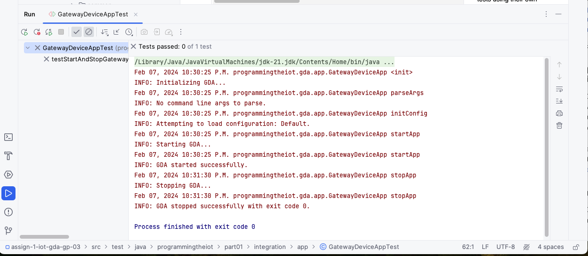

# Gateway Device Application (Connected Devices)

## Lab Module 01

Be sure to implement all the PIOT-GDA-* issues (requirements) listed at [PIOT-INF-01-001 - Lab Module 01](https://github.com/orgs/programming-the-iot/projects/1#column-9974937).

### Description

NOTE: Include two full paragraphs describing your implementation approach by answering the questions listed below.

**What does your implementation do?**

The gateway device application will provide data management, analytics, and
configuration management functionality.
Its primary role is to manage data and the connections between the CDA and cloud services that exist within the Cloud Tier.
It will manage data locally as appropriate and will sometimes take action by sending a command to the constrained device that triggers an actuation.
It will also manage some of the configuration settings—that is, those that represent nominal ranges for your environment—and will perform some initial analytics when new telemetry is received.

**How does your implementation work?**

The following steps should be taken to run this work.

1. Install Java 11 or update version of this.
2. Install Git.
3. Create a working directory and clone this repository.
4. Configure an IDE (Intelij or eclipse preferred).
5. Install Maven Dependencies through mvn install.
6. Run GatewayDeviceApp as Java Application.

### Code Repository and Branch

NOTE: Be sure to include the branch (e.g. https://github.com/programming-the-iot/python-components/tree/alpha001).

URL: 

### UML Design Diagram(s)

NOTE: Include one or more UML designs representing your solution. It's expected each
diagram you provide will look similar to, but not the same as, its counterpart in the
book [Programming the IoT](https://learning.oreilly.com/library/view/programming-the-internet/9781492081401/).

### Unit Tests Executed

NOTE: TA's will execute your unit tests. You only need to list each test case below
(e.g. ConfigUtilTest, DataUtilTest, etc). Be sure to include all previous tests, too,
since you need to ensure you haven't introduced regressions.

### Integration Tests Executed

NOTE: TA's will execute most of your integration tests using their own environment, with
some exceptions (such as your cloud connectivity tests). In such cases, they'll review
your code to ensure it's correct. As for the tests you execute, you only need to list each
test case below (e.g. SensorSimAdapterManagerTest, DeviceDataManagerTest, etc.)

EOF.
