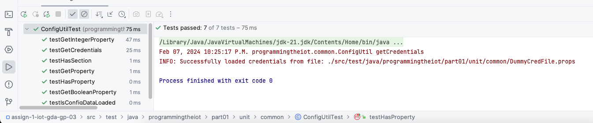
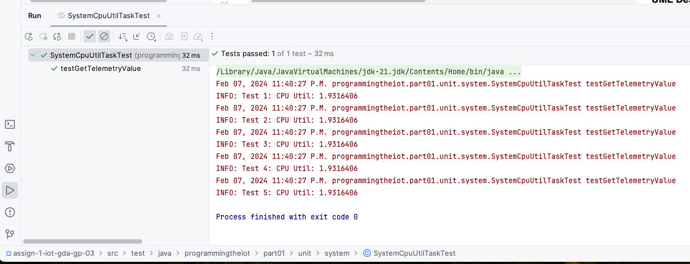
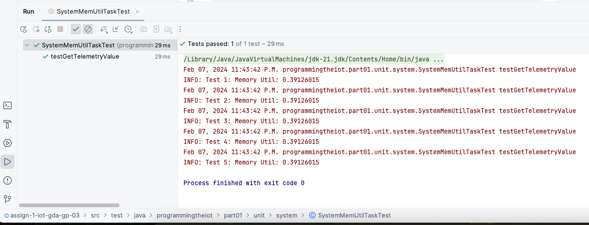
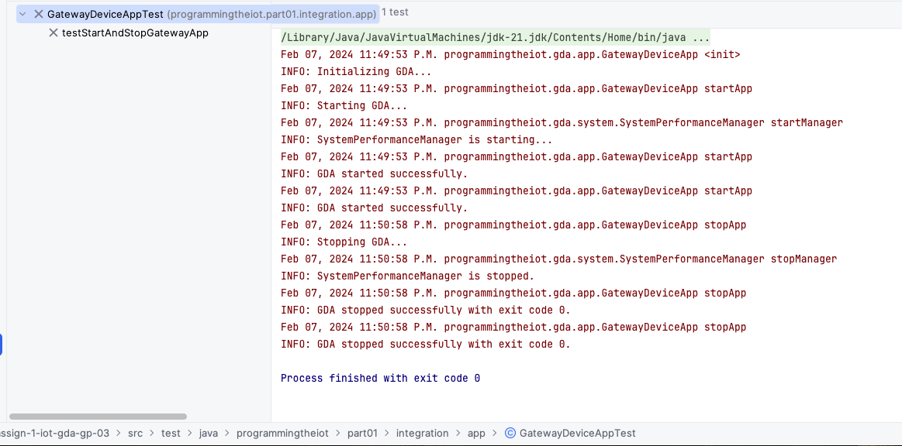

# Gateway Device Application (Connected Devices)

## Lab Module 02

Be sure to implement all the PIOT-GDA-* issues (requirements) listed at [PIOT-INF-02-001 - Lab Module 02](https://github.com/orgs/programming-the-iot/projects/1#column-9974938).

### Description

NOTE: Include two full paragraphs describing your implementation approach by answering the questions listed below.

**What does your implementation do?** 

This implementation will collect basic system performance data 
(e.g. CPU utilization, memory utilization, etc.) at a regular interval and
log it using the system logger. 
Particularly, this lab module will integrate with system performance
to give system performance data.

**How does your implementation work?**

To perform this implementation, need to run GatewayDeviceAppTest and SystemPerformanceTest.
For unit testing, SystemCpuUtilTask and SystemMemUtilTask need to run.

### Code Repository and Branch

NOTE: Be sure to include the branch (e.g. https://github.com/programming-the-iot/python-components/tree/alpha001).

URL: 

### UML Design Diagram(s)

NOTE: Include one or more UML designs representing your solution. It's expected each
diagram you provide will look similar to, but not the same as, its counterpart in the
book [Programming the IoT](https://learning.oreilly.com/library/view/programming-the-internet/9781492081401/).

### Unit Tests Executed

NOTE: TA's will execute your unit tests. You only need to list each test case below
(e.g. ConfigUtilTest, DataUtilTest, etc). Be sure to include all previous tests, too,
since you need to ensure you haven't introduced regressions.

Config Util Test

System Cpu Util Task Test

System Memory Util Task Test

### Integration Tests Executed

NOTE: TA's will execute most of your integration tests using their own environment, with
some exceptions (such as your cloud connectivity tests). In such cases, they'll review
your code to ensure it's correct. As for the tests you execute, you only need to list each
test case below (e.g. SensorSimAdapterManagerTest, DeviceDataManagerTest, etc.)

Gateway Device App Test Initial Phrase

System Performance Manager Test 

Gateway Device App Test Finally

EOF.
